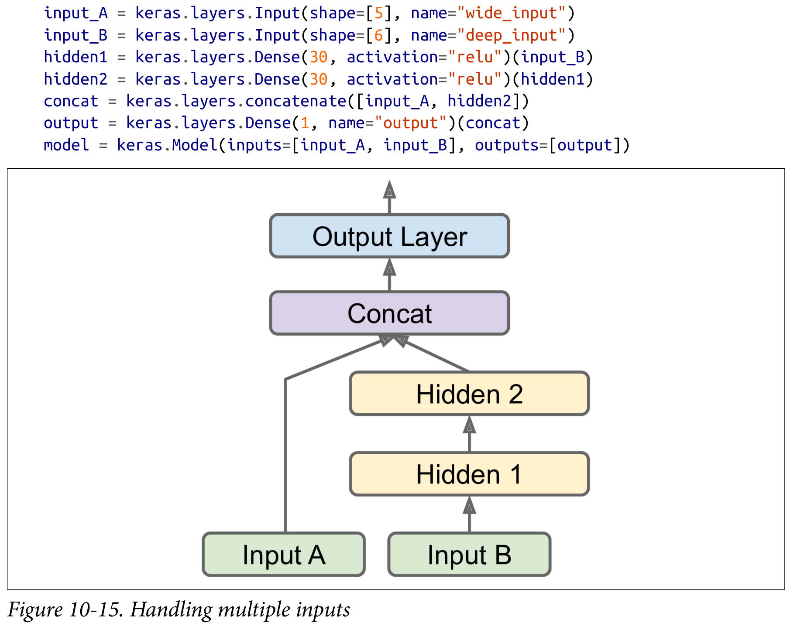
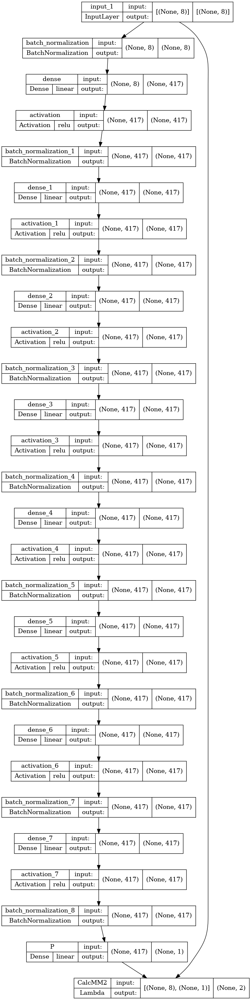

# Example Proton Momentum Corrections for CLAS12

The neural network predicts $\Delta \log(\text{proton}_P)$, uses a custom layer to calculte $\text{MM}^2$, then simultaneously minimizes $\Delta \log(\text{proton}_P)$ and $\Delta \text{MM}^2$. (see the image at the bottom)
* Using $\log(\text{proton}_P)$ transforms the input and output distributions to pseudo-Gaussian.
* Bad exploding gradient problem -> use Adam/RMSprop with small learning_rate or SGD with clipnorm/clipval

```python
X = [ log(ele_P), ele_Theta, ele_Phi, log(bad_pro_P), bad_pro_Theta, bad_pro_Phi, log(bad_Q2), log(bad_t) ]
y = [ log(good_pro_P) - log(bad_pro_P), good_mm2 - bad_mm2 ]
```

While I am training with respect to the electron momentum it would be very easy to split the input and train on just the proton momentum while still using my Lambda layer to calculate $\text{MM}^2$. Then when we want to deploy the model, we just extract the the layers that predict $\Delta \text{proton}_P$ and we are independent of electron statistics.

e.g.


Figure 10-15 from Hands-On Machine Learning with Scikit-Learn, Keras, and TensorFlow, 2nd Edition by Aurélien Géron

## Performance:
* [Analysis.ipynb](analysis.ipynb)

## Feature Importances From a High Variance Random Forest:
> Using a random forest I got a better validation MSE without any regularization/tuning, might be good to test some other models too.
* 32.8% - bad_pro_Theta 
* 15.6% - log(bad_t) 
* 13.6% - bad_pro_P 
* 09.8% - log(q2) 
* 09.6% - ele_P 
* 06.7% - bad_pro_Phi 
* 06.4% - ele_Phi 
* 05.5% - ele_Theta 


## Model Summary:
```
Model: "model"
__________________________________________________________________________________________________
 Layer (type)                   Output Shape         Param #     Connected to                     
==================================================================================================
 input_1 (InputLayer)           [(None, 8)]          0           []                               
                                                                                                  
 batch_normalization (BatchNorm  (None, 8)           32          ['input_1[0][0]']                
 alization)                                                                                       
                                                                                                  
 dense (Dense)                  (None, 417)          3753        ['batch_normalization[0][0]']    
                                                                                                  
 activation (Activation)        (None, 417)          0           ['dense[0][0]']                  
                                                                                                  
 batch_normalization_1 (BatchNo  (None, 417)         1668        ['activation[0][0]']             
 rmalization)                                                                                     
                                                                                                  
 dense_1 (Dense)                (None, 417)          174306      ['batch_normalization_1[0][0]']  
                                                                                                  
 activation_1 (Activation)      (None, 417)          0           ['dense_1[0][0]']                
                                                                                                  
 batch_normalization_2 (BatchNo  (None, 417)         1668        ['activation_1[0][0]']           
 rmalization)                                                                                     
                                                                                                  
 dense_2 (Dense)                (None, 417)          174306      ['batch_normalization_2[0][0]']  
                                                                                                  
 activation_2 (Activation)      (None, 417)          0           ['dense_2[0][0]']                
                                                                                                  
 batch_normalization_3 (BatchNo  (None, 417)         1668        ['activation_2[0][0]']           
 rmalization)                                                                                     
                                                                                                  
 dense_3 (Dense)                (None, 417)          174306      ['batch_normalization_3[0][0]']  
                                                                                                  
 activation_3 (Activation)      (None, 417)          0           ['dense_3[0][0]']                
                                                                                                  
 batch_normalization_4 (BatchNo  (None, 417)         1668        ['activation_3[0][0]']           
 rmalization)                                                                                     
                                                                                                  
 dense_4 (Dense)                (None, 417)          174306      ['batch_normalization_4[0][0]']  
                                                                                                  
 activation_4 (Activation)      (None, 417)          0           ['dense_4[0][0]']                
                                                                                                  
 batch_normalization_5 (BatchNo  (None, 417)         1668        ['activation_4[0][0]']           
 rmalization)                                                                                     
                                                                                                  
 dense_5 (Dense)                (None, 417)          174306      ['batch_normalization_5[0][0]']  
                                                                                                  
 activation_5 (Activation)      (None, 417)          0           ['dense_5[0][0]']                
                                                                                                  
 batch_normalization_6 (BatchNo  (None, 417)         1668        ['activation_5[0][0]']           
 rmalization)                                                                                     
                                                                                                  
 dense_6 (Dense)                (None, 417)          174306      ['batch_normalization_6[0][0]']  
                                                                                                  
 activation_6 (Activation)      (None, 417)          0           ['dense_6[0][0]']                
                                                                                                  
 batch_normalization_7 (BatchNo  (None, 417)         1668        ['activation_6[0][0]']           
 rmalization)                                                                                     
                                                                                                  
 dense_7 (Dense)                (None, 417)          174306      ['batch_normalization_7[0][0]']  
                                                                                                  
 activation_7 (Activation)      (None, 417)          0           ['dense_7[0][0]']                
                                                                                                  
 batch_normalization_8 (BatchNo  (None, 417)         1668        ['activation_7[0][0]']           
 rmalization)                                                                                     
                                                                                                  
 P (Dense)                      (None, 1)            418         ['batch_normalization_8[0][0]']  
                                                                                                  
 CalcMM2 (Lambda)               (None, 2)            0           ['input_1[0][0]',                
                                                                  'P[0][0]']                      
                                                                                                  
==================================================================================================
Total params: 1,237,689
Trainable params: 1,231,001
Non-trainable params: 6,688
__________________________________________________________________________________________________
```



